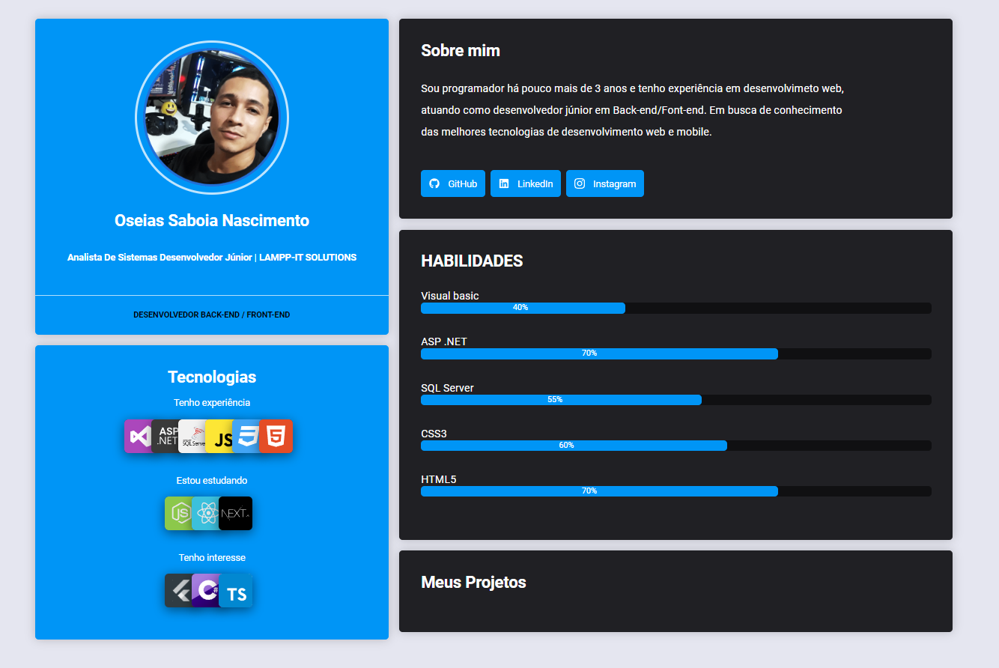

  <a href="#-tecnologias">Tecnologias</a>&nbsp;&nbsp;&nbsp;|&nbsp;&nbsp;&nbsp;
  <a href="#-projeto">Projeto</a>&nbsp;&nbsp;&nbsp;|&nbsp;&nbsp;&nbsp;
  <a href="#-layout">Layout</a>&nbsp;&nbsp;&nbsp;|&nbsp;&nbsp;&nbsp;
  <a href="#memo-licença">Licença</a>

 

  

 

  

## 🚀 Tecnologias

Esse projeto foi desenvolvido com as seguintes tecnologias:

- ReactJS
- GraphQL
- JavaScript
- TypeScript
- Tailwindcss
- @apollo/client
- Phosphor-React
- HTML
- CSS

## 💻 Projeto

Event Plataform é uma plataforma de conteúdos em vídeo.

## 🔖 Layout

Você pode visualizar o layout do projeto através [desse link](https://www.figma.com/file/iRgpd71FFiJvfmJHn0Uy1Y/Plataforma-de-evento---Ignite-Lab-(Community)?node-id=0%3A1). É necessário ter conta no [Figma](https://figma.com) para acessá-lo.

## 📝 Licença

Esse projeto está sob a licença MIT. Veja o arquivo [LICENSE](LICENSE) para mais detalhes.

---

Feito com ♥ by Oseias Saboia :wave:
